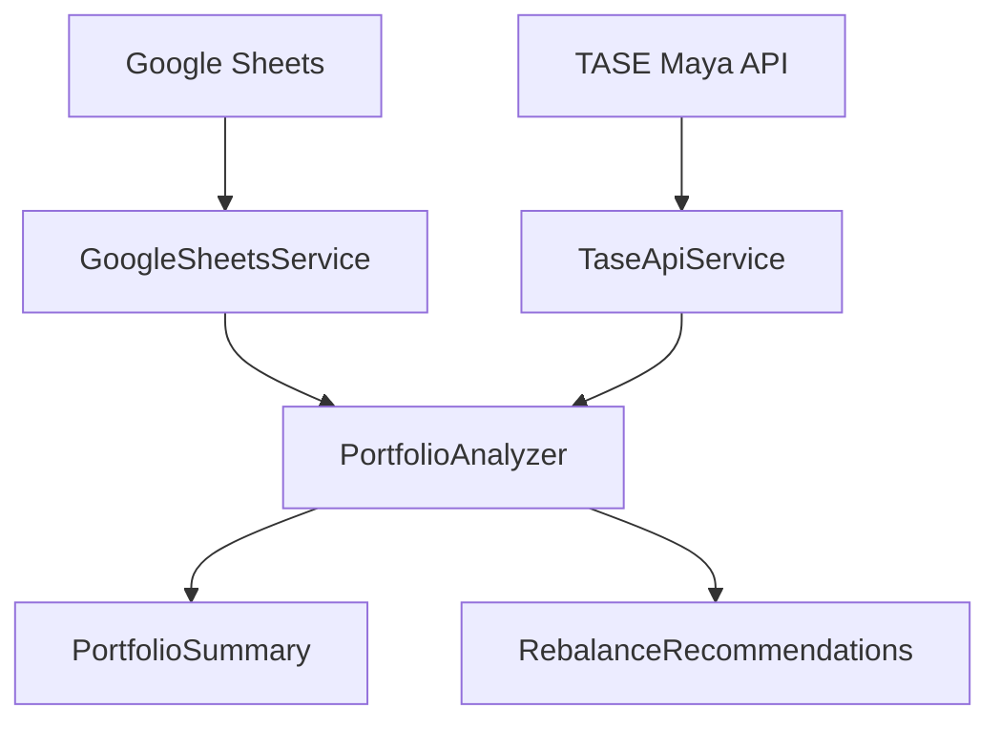

# @portfolio/core

The core shared library for the Financial Portfolio Management system. This package contains all the business logic, services, types, and utilities that are shared between the web application and MCP server.

## 📦 Package Contents

### 🔧 Services

#### `TaseApiService`
Handles real-time market data from Tel Aviv Stock Exchange (TASE) Maya API.

```typescript
import { TaseApiService } from '@portfolio/core';

const taseService = new TaseApiService('/api/maya');
const securityInfo = await taseService.getSecurityInfo('5131022');
```

**Features:**
- Real-time ETF and mutual fund data
- Automatic fund type detection (bonds vs shares)
- Batch processing with rate limiting
- Comprehensive error handling

#### `GoogleSheetsService`
Manages portfolio transaction data from Google Sheets.

```typescript
import { GoogleSheetsService } from '@portfolio/core';

const sheetsService = new GoogleSheetsService('your-api-key');
const transactions = await sheetsService.getPortfolioData('spreadsheet-id');
```

**Features:**
- Portfolio transaction parsing
- Support for multiple data formats
- Automatic currency conversion (agorot ↔ ILS)
- Sheet validation and testing

#### `PortfolioAnalyzer`
Core portfolio analysis and rebalancing engine.

```typescript
import { PortfolioAnalyzer } from '@portfolio/core';

const analyzer = new PortfolioAnalyzer(
  { bond: 0.6, share: 0.4 }, // Target distribution
  customSecurities // Pension funds, etc.
);

const summary = analyzer.analyzePortfolio(transactions, marketData);
const rebalance = analyzer.calculateRebalance(summary, 10000);
```

**Features:**
- Comprehensive portfolio metrics calculation
- Intelligent rebalancing recommendations
- Custom securities integration
- Tax-optimized calculations

### 🏷️ Types

Complete TypeScript interfaces for all portfolio-related data:

```typescript
import { 
  PortfolioSummary, 
  PortfolioSecurity, 
  RebalanceRecommendation,
  SecurityInfo,
  PortfolioAction,
  CustomSecurity 
} from '@portfolio/core';
```

### 🛠️ Utilities

#### Formatters
```typescript
import { formatCurrency, formatPercentage, formatAmount } from '@portfolio/core';

formatCurrency(1234.56); // "₪1,234.56"
formatPercentage(0.1234); // "12.34%"
formatAmount(100.5); // "100.5"
```

#### Configuration
```typescript
import { APP_CONFIG } from '@portfolio/core';

APP_CONFIG.API.TIMEOUT; // 10000ms
APP_CONFIG.PORTFOLIO.BOND_TYPE; // "Bond"
```

## 🚀 Installation

```bash
npm install @portfolio/core
```

## 💻 Usage

### Basic Portfolio Analysis

```typescript
import { 
  GoogleSheetsService, 
  TaseApiService, 
  PortfolioAnalyzer 
} from '@portfolio/core';

async function analyzePortfolio() {
  // Initialize services
  const sheetsService = new GoogleSheetsService(apiKey);
  const taseService = new TaseApiService(baseUrl);
  
  // Get transaction data
  const transactions = await sheetsService.getPortfolioData(spreadsheetId);
  
  // Get market data
  const fundIds = transactions.map(t => t.fundId).filter(Boolean);
  const marketData = await taseService.getMultipleSecurities(fundIds);
  
  // Analyze portfolio
  const analyzer = new PortfolioAnalyzer(targetDistribution, customSecurities);
  const summary = analyzer.analyzePortfolio(transactions, marketData);
  
  console.log('Portfolio Value:', summary.totalMarketValue);
  console.log('Total Return:', summary.totalIncome);
}
```

### Portfolio Rebalancing

```typescript
const rebalanceResult = analyzer.calculateRebalance(
  portfolioSummary, 
  additionalInvestment
);

rebalanceResult.recommendations.forEach(rec => {
  console.log(`${rec.action} ${rec.amount} units of ${rec.security.name}`);
});
```

### Market Data Integration

```typescript
// Test API connectivity
const connectionTest = await taseService.testConnection();
if (connectionTest.success) {
  console.log('TASE API connected successfully');
}

// Get specific security info
const etfInfo = await taseService.getSecurityInfo('1150531');
console.log('Current price:', etfInfo.currentPrice);
console.log('Management fee:', etfInfo.managementFee);
```

## 🌍 Environment Configuration

The core package is environment-agnostic and accepts configuration through constructor parameters:

```typescript
// Development
const taseService = new TaseApiService('/api/maya');

// Production
const taseService = new TaseApiService('/.netlify/functions/maya-proxy');

// Custom endpoint
const taseService = new TaseApiService('https://api.example.com/tase');
```

## 📊 Data Flow



## 🔧 Development

### Building

```bash
npm run build
```

### Type Checking

```bash
npm run dev  # Watch mode
```

### Testing

```bash
npm test
```

## 📁 Package Structure

```
src/
├── services/
│   ├── taseApiService.ts      # TASE API integration
│   ├── googleSheetsService.ts # Google Sheets integration
│   └── portfolioAnalyzer.ts   # Portfolio analysis engine
├── types/
│   └── index.ts               # TypeScript interfaces
├── config/
│   └── constants.ts           # Application constants
├── utils/
│   └── formatters.ts          # Utility functions
└── index.ts                   # Main exports
```

## 🔗 Dependencies

- **axios**: HTTP client for API requests
- **decimal.js**: Precision arithmetic for financial calculations

## 📄 License

MIT - See [LICENSE](../../LICENSE) file for details.

## 🆘 Support

- **Issues**: [GitHub Issues](https://github.com/shlatchz/financial-portfolio/issues)
- **Documentation**: [Main README](../../README.md)
- **Examples**: See [web](../web) and [mcp](../mcp) packages for usage examples 