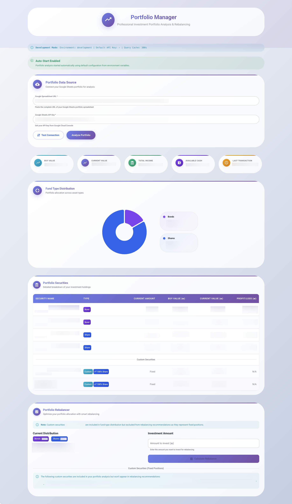

# @portfolio/web

Modern React web application for financial portfolio management. Features real-time market data, interactive analytics, and intelligent rebalancing recommendations.



## ✨ Features

### 🎯 Core Functionality
- **Real-time Market Data**: Live prices from Tel Aviv Stock Exchange (TASE)
- **Portfolio Analytics**: Comprehensive profit/loss and performance metrics
- **Smart Rebalancing**: AI-powered allocation recommendations
- **Google Sheets Integration**: Automatic transaction history import
- **Custom Securities**: Support for pension funds, savings accounts, etc.

### 🎨 Modern UI/UX
- **Material-UI Design**: Professional, responsive interface
- **Interactive Charts**: Real-time data visualization with MUI X Charts
- **RTL Support**: Full Hebrew language support with proper text direction
- **Dark/Light Themes**: Automatic theme detection and switching
- **Glass-morphism Effects**: Modern visual design with smooth animations

### 📊 Portfolio Features
- **Multi-Asset Support**: ETFs, mutual funds, bonds, stocks
- **Real-time Valuation**: Live portfolio value calculation
- **Commission Tracking**: Transaction cost analysis
- **Cash Management**: Available funds and deposit tracking
- **Tax Optimization**: Israeli tax considerations for investments

### **NEW: MCP AI Tools Panel**
The web application now includes a comprehensive Model Context Protocol (MCP) tools panel that provides AI-powered portfolio analysis capabilities:

#### Available MCP Tools:
- **Portfolio Configuration**: Set up Google Sheets API integration and target allocations
- **Portfolio Status**: Get real-time portfolio status and holdings information
- **Security Lookup**: Retrieve detailed information about specific securities by ID
- **Financial Advice**: Get AI-powered rebalancing recommendations with optional additional investment
- **Performance Analysis**: Comprehensive portfolio performance metrics and analysis
- **Connection Testing**: Verify API connections to Google Sheets and TASE

#### How to Use MCP Tools:
1. **Configuration Required**: First configure your Google Sheets API key and spreadsheet ID in the MCP panel
2. **API Availability**: The panel automatically detects if MCP API is available (local or deployed)
3. **Interactive Tools**: Each tool provides a clean interface with real-time results
4. **Copy Results**: All tool responses can be copied to clipboard for further analysis

#### Environment Setup:
- **Local Development**: Start with `netlify dev` to enable MCP API at `http://localhost:8888/api/mcp`
- **Production**: MCP API available at `/api/mcp` when deployed to Netlify
- **Auto-Detection**: The app automatically uses the correct endpoint based on environment

## 🚀 Quick Start

### Prerequisites
- Node.js ≥ 18.0.0
- npm ≥ 9.0.0
- Google Sheets API key

### Installation

```bash
# From monorepo root
npm install

# Build core dependency
npm run build --workspace=packages/core

# Start development server
npm run dev
```

The application will be available at `http://localhost:3000`

### Environment Setup

Create `.env` file in the web package directory:

```bash
# Optional: Default Google Sheets configuration (auto-starts the app)
VITE_DEFAULT_GOOGLE_SHEETS_API_KEY=your_google_sheets_api_key_here
VITE_DEFAULT_SPREADSHEET_URL=https://docs.google.com/spreadsheets/d/YOUR_SHEET_ID

# Development Configuration
VITE_ENVIRONMENT=development

# Optional: Custom MCP API URL (auto-detected by default)
VITE_MCP_API_URL=https://your-custom-mcp-endpoint.com/api/mcp

# Portfolio target distribution
VITE_FUNDS_TYPE_DISTRIBUTION_BOND=0.2
VITE_FUNDS_TYPE_DISTRIBUTION_SHARE=0.8

# Custom securities (JSON array)
VITE_CUSTOM_SECURITIES='[{"id":"pension-1","bondPercentage":0.6,"sharePercentage":0.4,"value":50000,"date":"2024-01-01"}]'
```

### Google Sheets Setup

Your portfolio spreadsheet should have these columns:

| Column | Description | Example |
|--------|-------------|---------|
| A | Date | 2024-01-15 |
| B | Operation | BUY/SELL/DEPOSIT |
| C | Fund ID | 5131022 |  
| D | Amount | 100 |
| E | Value | 15050 (agorot for securities, ILS for deposits) |
| F | Commission | 500 (agorot) |

**Important**: Make your spreadsheet publicly viewable or use service account authentication.

## 🏗️ Architecture

### Component Structure

```
src/
├── components/
│   ├── PortfolioChart.tsx          # Asset allocation visualization
│   ├── PortfolioForm.tsx           # Configuration and data input
│   ├── PortfolioRebalancer.tsx     # Rebalancing recommendations
│   ├── PortfolioSummaryCards.tsx   # Key metrics display
│   ├── SecuritiesTable.tsx         # Holdings details table
│   ├── McpPanel.tsx              # NEW: MCP AI tools interface
│   └── usePortfolioData.ts         # Portfolio data management
├── services/
│   └── mcpApiService.ts          # NEW: MCP API client
├── config/
│   ├── constants.ts                # Application constants
│   └── env.ts                      # Environment configuration
├── theme/
│   └── index.ts                    # Material-UI theme
└── utils/
    └── textDirection.ts            # RTL text handling
```

### State Management
- **TanStack Query**: Server state management and caching
- **React Hooks**: Local component state
- **Material-UI Theme**: Global styling and theming

### API Integration
- **Development**: Vite proxy to TASE Maya API (`/api/maya`)
- **Production**: Netlify functions proxy (`/.netlify/functions/maya-proxy`)
- **Google Sheets**: Direct API access with CORS handling

## 💻 Usage

### Basic Portfolio Analysis

1. **Enter API Credentials**: Google Sheets API key and spreadsheet URL
2. **Configure Portfolio**: Set target bond/share distribution
3. **Add Custom Securities**: Include pension funds, savings, etc.
4. **Analyze Portfolio**: Get real-time insights and recommendations

### Rebalancing Workflow

1. **View Current Allocation**: See bond/share distribution charts
2. **Enter Investment Amount**: Specify additional funds to invest
3. **Get Recommendations**: Receive specific buy/sell suggestions
4. **Review Actions**: See detailed fund-by-fund recommendations

### Custom Securities Management

```typescript
// Example custom securities configuration
const customSecurities = [
  {
    id: "Pension401k",
    bondPercentage: 0.6,    // 60% bonds
    sharePercentage: 0.4,   // 40% shares
    value: 75000,           // Current value in ILS
    date: "2024-01-15"
  }
];
```

## 🔧 Development

### Available Scripts

```bash
# Development
npm run dev          # Start development server
npm run build        # Production build
npm run preview      # Preview production build

# Code Quality
npm run lint         # ESLint checking
npm run lint:fix     # Fix ESLint issues
npm run type-check   # TypeScript validation

# Utilities
npm run clean        # Clear build artifacts
npm run start        # Alias for dev
```

### Development Features

- **Hot Module Replacement**: Instant updates during development
- **TypeScript**: Full type safety and IntelliSense
- **ESLint**: Code quality enforcement
- **Vite**: Lightning-fast builds and development server

### Proxy Configuration

The development server proxies TASE API requests to avoid CORS issues:

```typescript
// vite.config.ts
server: {
  proxy: {
    '/api/maya': {
      target: 'https://maya.tase.co.il',
      changeOrigin: true,
      rewrite: (path) => path.replace(/^\/api\/maya/, '/api/v1/funds')
    }
  }
}
```

## 🌍 Deployment

### Netlify (Recommended)

The application is optimized for Netlify deployment:

1. **Connect Repository**: Link your GitHub repo to Netlify
2. **Build Settings**: Configured automatically via `netlify.toml`
3. **Environment Variables**: Set in Netlify dashboard:
   - `VITE_DEFAULT_GOOGLE_SHEETS_API_KEY`
   - `VITE_DEFAULT_SPREADSHEET_URL` (optional)

### Manual Deployment

```bash
# Build for production
npm run build

# Deploy dist/ directory to your hosting provider
```

### Environment Variables

Production environment variables:

```bash
VITE_DEFAULT_GOOGLE_SHEETS_API_KEY=your_production_api_key
VITE_DEFAULT_SPREADSHEET_URL=https://docs.google.com/spreadsheets/d/YOUR_SHEET_ID
```

## 📊 Features Deep Dive

### Portfolio Analytics
- **Total Portfolio Value**: Real-time market value calculation
- **Profit/Loss Tracking**: Compare current vs. purchase values
- **Performance Metrics**: ROI, income, and growth analysis
- **Asset Allocation**: Visual bond/share distribution

### Smart Rebalancing
- **Target Distribution**: Configurable bond/share percentages
- **Optimization**: Considers transaction costs and tax implications
- **Custom Securities**: Includes non-tradeable assets in calculations
- **Action Recommendations**: Specific buy/sell suggestions with amounts

### Market Data Integration
- **TASE Maya API**: Real-time Israeli stock exchange data
- **Fund Information**: Prices, fees, classifications, and metadata
- **Batch Processing**: Efficient multiple security lookups
- **Error Handling**: Graceful fallbacks for missing data

### User Experience
- **Responsive Design**: Works on desktop, tablet, and mobile
- **RTL Support**: Proper Hebrew text rendering and layout
- **Loading States**: Smooth data loading with skeleton screens
- **Error Messages**: User-friendly error handling and recovery

## 🔒 Security

- **API Key Protection**: Client-side environment variables only
- **CORS Handling**: Proper cross-origin request configuration
- **Input Validation**: Sanitized user inputs and API responses
- **No Data Storage**: Portfolio data remains in your Google Sheets

## 🐛 Troubleshooting

### Common Issues

**"Google Sheets API key not configured"**
- Check `.env` file in `packages/web/`
- Restart development server after adding variables
- Verify API key permissions in Google Cloud Console

**"Unable to access spreadsheet"**
- Ensure spreadsheet is publicly viewable
- Verify spreadsheet URL format
- Check Google Sheets API is enabled

**Vite proxy errors**
- Check internet connection to TASE Maya API
- Verify proxy configuration in `vite.config.ts`
- Some securities may be temporarily unavailable

**Build errors**
- Ensure core package is built: `npm run build --workspace=packages/core`
- Clear build cache: `npm run clean`
- Check TypeScript errors: `npm run type-check`

## 🔗 Dependencies

### Core Dependencies
- **React 18**: Modern React with concurrent features
- **Material-UI v5**: Professional React components
- **TanStack Query**: Server state management
- **@portfolio/core**: Shared business logic

### Development Dependencies
- **Vite**: Fast build tool and development server
- **TypeScript**: Type safety and developer experience
- **ESLint**: Code quality and consistency

## 📄 License

MIT - See [LICENSE](../../LICENSE) file for details.

## 🆘 Support

- **Documentation**: [Main README](../../README.md) and [Environment Guide](../../ENV_GUIDE.md)
- **Core Library**: [Core Package README](../core/README.md)
- **Issues**: [GitHub Issues](https://github.com/your-org/financial-portfolio-monorepo/issues)
- **Live Demo**: [View Demo](https://financial-portfolio-shlatchz.netlify.app/)

## Testing

### Running Tests

```bash
# Run all tests
npm test

# Run tests in watch mode
npm run test:watch

# Run tests with UI
npm run test:ui

# Run coverage tests
npm run test:coverage

# Run proxy configuration tests specifically
npm run test:proxy

# Run end-to-end tests
npm run test:e2e
```

### Proxy Configuration Tests

The project includes comprehensive tests to prevent the API proxy configuration issues that occurred during development:

- **`vite-config.test.ts`** - Tests the proxy configuration logic
- **`api-proxy.test.ts`** - Integration tests for API proxy functionality
- **`development-environment.test.ts`** - Tests environment-specific configurations
- **`vite-config-validation.test.ts`** - Validates the actual vite.config.ts file
- **`ci-proxy-validation.test.ts`** - CI-specific tests to prevent configuration regression

These tests ensure that:
- Proxy routes are correctly configured for both TASE API and MCP API
- Path rewriting functions work properly
- Error handling is configured
- Development and production environments are handled correctly
- The configuration is maintained during code changes

---

**Made with ❤️ for investors and developers** 